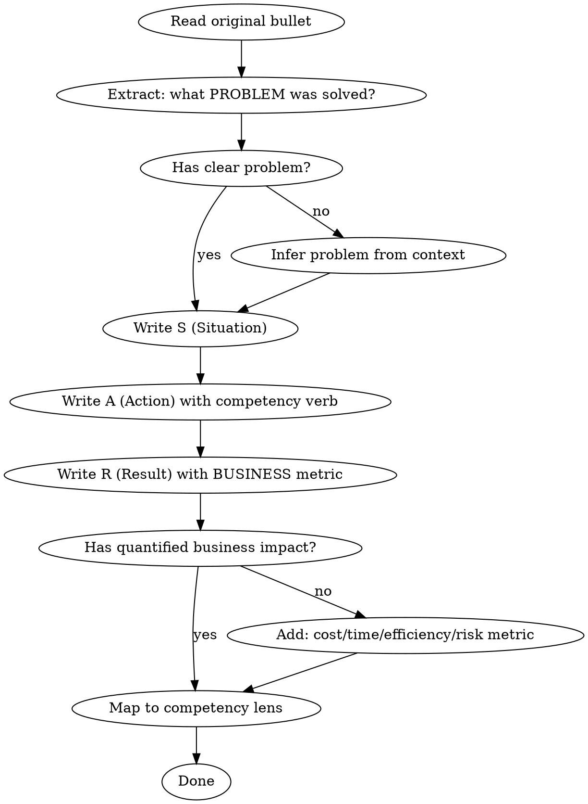

# Consulting Resume Optimizer

## Overview

Transform technical/operational resume bullets into consulting-ready narratives by enforcing **SAR structure**, **4 core competency mapping**, and **business-impact quantification**. Consultants sell problem-solving, not task execution.

## When to Use

- Rewriting resume for consultant/advisory/strategist roles
- Transforming engineer/technical bullets into business narratives
- Preparing for management consulting or technology consulting interviews
- User mentions: consulting, advisory, bank consultant, technology consultant

**Not for:** General resume polishing, academic CV, purely technical roles

## Core Principle

```
❌ "負責 X" (Responsible for X)
✅ "因為 Y 問題（S），執行 Z 策略（A），達成 W 成果（R）"
```

Every bullet MUST follow **SAR** — no exceptions.

## The 4 Competency Lenses

Every bullet must map to at least one:

| Competency | What to Show | Signal Words |
|-----------|-------------|-------------|
| **Problem Solving** | Identified root cause → designed solution → measured outcome | 分析、診斷、識別、設計解決方案、根因分析 |
| **Data-Driven** | Used data/metrics to inform decisions or measure impact | 數據分析、建立指標、儀表板、量化、模型、A/B 測試 |
| **Business Sense** | Understood industry/cost/revenue/compliance implications | 成本結構、合規、市場分析、ROI、營運效率、風險評估 |
| **Communication** | Influenced stakeholders, led cross-team alignment | 提案、跨部門協調、簡報、說服、利害關係人管理 |

## Rewriting Process



## Quantification Rules

**Technical metrics alone are NOT enough.** Always bridge to business impact:

| Technical Metric | Bridge to Business |
|-----------------|-------------------|
| QPS / throughput | → 支撐 N 用戶營運規模、避免營收損失 |
| Memory reduced 20% | → 年度基礎設施成本節省 $X / N% |
| Migration completed | → 維運人力縮減 N%、部署速度提升 N 倍 |
| Uptime 99.9% | → 符合 SLA 合規要求、客戶零投訴 |
| Response time < 100ms | → 用戶體驗達金融級標準、客戶滿意度提升 |

**If you can't find a number, use relative improvement:** 「提升 N 倍」「縮短至 1/N」「從 X 改善至 Y」

## Verb Selection

**Avoid repeating:** 主導、負責、開發、維護

**Use consulting verbs:**

| Category | Verbs |
|----------|-------|
| Analysis | 分析、診斷、評估、審計、量化 |
| Strategy | 規劃、提案、制定策略、設計方案 |
| Execution | 推動、導入、落地、交付、實施 |
| Impact | 實現、達成、優化、降低、提升 |
| Leadership | 帶領、協調、整合、說服、培訓 |

**Rules:**
- No two adjacent bullets should start with the same verb
- No two adjacent bullets should start with verbs from the same category
- When rewriting multiple bullets, assign verb categories FIRST, then write content

## Before/After Examples

### Example 1: Technical → Consulting

**Before (技術導向):**
> 主導後端系統架構設計與持續優化，外部 API 穩定承載 8,000 QPS，確保服務高可用

**After (顧問導向):**
> 診斷既有架構效能瓶頸，重新設計 API 服務層與快取策略，將系統承載力提升至 **8,000 QPS**，支撐日均 **百萬級**交易量與跨區域營運擴展需求，服務可用性達 **99.9%** 以上

**Why better:** Has S (瓶頸), A (重新設計), R (百萬級交易 + 99.9%), maps to Problem Solving + Business Sense

### Example 2: Migration → Consulting

**Before:**
> 因應基礎架構調整需求，2 個月內完成數百台 On-Premises 服務遷移至 AWS 雲端

**After:**
> 評估地端基礎設施擴展瓶頸與維運成本，制定分階段雲端遷移策略並於 **2 個月內**完成**數百台**服務搬遷至 AWS，基礎設施成本降低 **30%**，部署週期從數天縮短至 **1 小時內**

**Why better:** Has S (瓶頸+成本), A (制定策略+分階段), R (成本-30% + 部署加速), maps to Business Sense + Problem Solving

## Banking/Financial Consulting Keywords

When targeting financial sector, weave in these naturally:

- 合規 (Compliance)、風險控管 (Risk Management)
- 資安架構 (Security Architecture)、存取控制 (Access Control)
- 金融級 SLA、交易一致性 (Transaction Consistency)
- 跨國 / 多幣別 (Cross-border / Multi-currency)
- 數位轉型 (Digital Transformation)
- 利害關係人管理 (Stakeholder Management)

## Common Mistakes

| Mistake | Fix |
|---------|-----|
| Only adding adjectives to original | Restructure narrative around SAR |
| Technical metrics without business bridge | Add cost/revenue/efficiency impact |
| Every bullet starts with 「主導」 | Vary verbs across competency categories |
| No Situation — jumps straight to Action | Ask: what problem triggered this work? |
| Consulting buzzwords without substance | Each claim must have a supporting metric |
| Bullet exceeds 2 lines | Split into S→A→R and cut filler words |

## Quality Checklist

Before finalizing each bullet:
- [ ] Has clear Situation (problem/trigger)?
- [ ] Action uses consulting-appropriate verb?
- [ ] Result has quantified BUSINESS metric (not just technical)?
- [ ] Maps to at least one of the 4 competencies?
- [ ] 1-2 lines maximum?
- [ ] No verb repetition with adjacent bullets?
